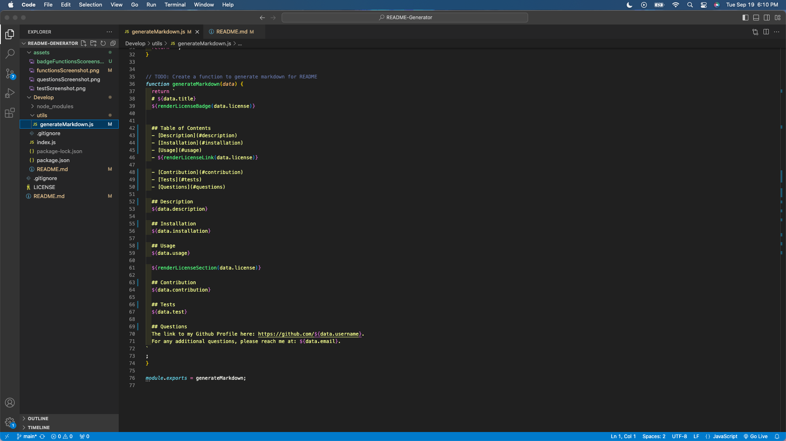
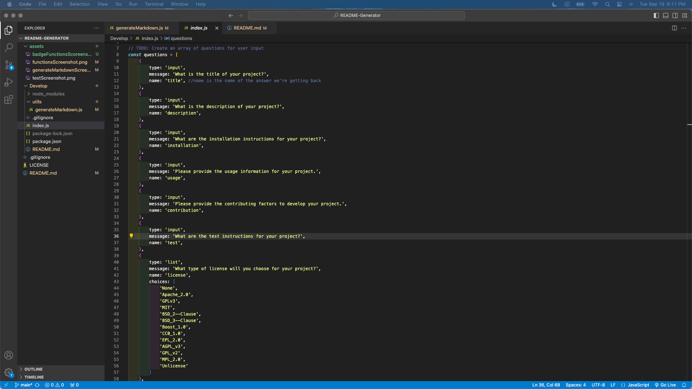

  # README-Generator

  ## Table of Contents
  - [Description](##Description)
  - [Installation](##Installation)
  - [Usage](##Usage)
  - [License](##License)
  - [Contribution](##Contribution)
  - [Tests](##Tests)
  - [Questions](##Questions)

  ## Description
  The purpose of creating a README-Generator through the command line in the terminal is to make the process of creating a README for repos more efficient. Upon opening the terminal, users answer a series of questions, and once complete, the README document will be dynamically created along with the responses appended to it, placed in their appropriate sections.
  View a video of the README-Generator here: https://drive.google.com/file/d/1MYjhsjsj7HMlvM6mHH5JYMt8tH00BTAv/view?usp=drive_link.

  ## Installation
  VS Code for JavaScript. GibHub for version control and for this repo. The npm inquirer@8.2.4 also needs to be installed. The link can be found here: https://www.npmjs.com/package/inquirer/v/8.2.4.

  ## Usage
  This can be used when users need to create a README for GitHub repos.

  View a screenshot of the functions for the npm in VS Code:
  
  View a screenshot of the README template here in VS Code:
  
  View a screenshot of the questions array here in VS Code:
  

  ## License
  None
  
  ## Contribution
  The starter JavaScript files are credited to the content in the starter-code repository, found here: https://github.com/coding-boot-camp/potential-enigma.
  The coding (variables, questions array, importing packages, conditional statements, console logs, writeToFile and init functions) -all the additions- are credited to the curriculum taught in the UCI coding boot camp and are credited to the instructor, the tutor, and classmates in the UCI coding boot camp.
  Information to download the inquirer package and on how to structure the prompt can be found here: https://www.npmjs.com/package/inquirer/v/8.2.4.
  To retrieve the license badge format, and for the naming conventions of the licenses in my questions, the resource can be found here: https://gist.github.com/lukas-h/2a5d00690736b4c3a7ba;
  To complete the README with screenshots, the source for the code is: https://stackoverflow.com/questions/10189356/how-to-add-screenshot-to-readmes-in-github-repository. 
  To complete the README section, the source is: https://coding-boot-camp.github.io/full-stack/github/professional-readme-guide.
  To complete the markdown for the README, the source is: https://www.markdownguide.org/basic-syntax/
  https://gist.github.com/lukas-h/2a5d00690736b4c3a7ba
  To record the README generator, the instructions can be found here: https://coding-boot-camp.github.io/full-stack/computer-literacy/video-submission-guide.
  To transform a video recording to a GIF, the link can be found here: https://ezgif.com/video-to-gif.

  ## Tests
  To test this README generator, make sure that the appropriate installations have been completed. Users can then clone this repo, navigate to the terminal of this directory, and test typing "node index" in the terminal command line. Answer the series of questions with "test" and select a license at random. Upon answering all questions, a new README file will be created in your VS code of the repo, or, if you have an existing README file, what the user inputted will overwrite what was on the README file previously. Please see a screenshot of an example below:

  ## Questions
  The link to my Github Profile here: https://github.com/codeandlift706.
  For any additional questions, please reach me at: channguyen715@gmail.com.
